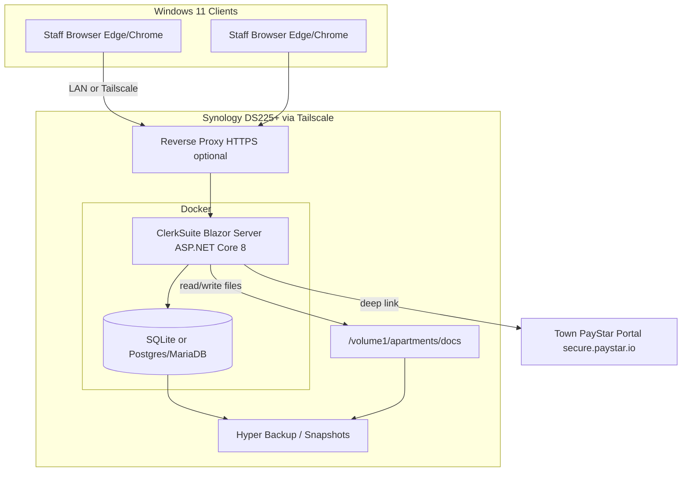

# Implementation Plan: ClerkSuite — Wiley Apartment Management v1

**Branch**: `001-wiley-apartment-v1` | **Date**: 2026-08-09 | **Spec**: [spec.md](./spec.md)

**Repository**: [github.com/Bigessfour/Wiley_Apartments](https://github.com/Bigessfour/Wiley_Apartments)

## Summary

Deliver **ClerkSuite** — a clerk-first Blazor Interactive Server application for 16 town
apartment units in **Town of Wiley, Colorado** — hosted on Synology DS225+ via Docker.
Syncfusion powers grids, dashboard, document editor, PDF viewer, file manager, charts, and
dialogs. Structured data in **SQLite** (default, single-container); PostgreSQL/MariaDB is an
**optional override only**. Documents on NAS shared folder `/volume1/apartments/docs`;
ASP.NET Core Identity — login required for audit attribution; **no role differentiation**
(all authenticated users have full access). Seed 1–2 full-access accounts.

---

## Tech Stack Decision

**Sole UI technology:** **Blazor Interactive Server** + **Syncfusion Blazor** — no other UI
framework or component library (no MudBlazor, Radzen, Angular, WASM-first UI, etc.).

| Layer                  | Choice                                                | Notes                                                                                           |
| ---------------------- | ----------------------------------------------------- | ----------------------------------------------------------------------------------------------- |
| **UI (sole stack)**    | Blazor **Interactive Server** + **Syncfusion Blazor** | Only approved UI path; all surfaces use `Sf*` components                                        |
| **Components**         | Syncfusion Blazor NuGet packages                      | Grid, DashboardLayout, DocumentEditor, PdfViewer, FileManager, Charts, Cards, Dialogs, Inputs   |
| **Backend**            | ASP.NET Core 8                                        | Single web host                                                                                 |
| **Data access**        | **Entity Framework Core** (primary)                   | Migrations, audit interceptor, Identity integration                                             |
|                        | Dapper (optional later)                               | Read-heavy reports only if profiling warrants                                                   |
| **Database (default)** | **SQLite** (production default)                       | Single-container deploy; DB file on NAS-bound Docker volume                                     |
| **Database (alt)**     | PostgreSQL 16 or MariaDB 11                           | **Optional override only** — `docker-compose.postgres.yml`; not default                         |
| **Documents**          | Synology shared folder                                | `/volume1/apartments/docs` mounted into container; metadata in DB                               |
| **Hosting**            | Docker via Synology Container Manager                 | DS225+; dev/deploy access via **Tailscale + SSH**; reverse proxy optional                       |
| **Auth**               | ASP.NET Core Identity                                 | Login required (audit); **no roles** — all authenticated users full access; 1–2 seeded accounts |
| **Clients**            | Modern browsers on Windows 11                         | Chrome / Edge recommended                                                                       |

### Rationale

- **No Angular** — per project requirement; Blazor + Syncfusion matches clerk UI needs.
- **Syncfusion** — enterprise grids, dashboard, and document surfaces without custom builds.
- **Blazor Server** — keeps memory reasonable on NAS; recommend **6 GB RAM** upgrade on DS225+ for headroom with two concurrent circuits.
- **Everything on existing NAS** — no new cloud spend; Hyper Backup / snapshots cover DB volume and doc share.
- **Browser + Docker over WinForms** — central updates, two concurrent clerks, no per-PC installs.

### Database strategy (v1)

```text
Production default:  1 container  → app + SQLite file on /data volume
Optional override:   2 containers → app + Postgres/MariaDB (explicit opt-in only)
```

SQLite file MUST live on a **Docker volume** (local to container mount), not on an SMB share
accessed over the network. Two clerks on Blazor Server serialize writes through one app
process — acceptable at 16-unit scale. Postgres/MariaDB override only if town IT explicitly
requests it (see [research.md](./research.md) Decisions 2, 21).

---

## Technical Context

**Language/Version**: C# / .NET 8 (LTS)

**Primary Dependencies**: ASP.NET Core Blazor **Interactive Server** (sole UI host), **Syncfusion Blazor** (sole UI components),
Entity Framework Core, ASP.NET Core Identity

**Storage**: SQLite (default) or PostgreSQL/MariaDB (alt) on NAS Docker volume; documents at
`/volume1/apartments/docs` (leases, templates, uploads subfolders)

**Testing**: xUnit unit + integration (`WebApplicationFactory`) + E2E (Playwright + HTTP); manual clerk acceptance per [quickstart.md](./quickstart.md). See [tests/README.md](../../../tests/README.md).

**Target Platform**: Synology DS225+ (Container Manager), Windows 11 browsers

**Project Type**: Single web application + Domain + Contracts libraries

**Performance Goals**: Dashboard &lt; 3 s on LAN (FR-6); grid search &lt; 2 s for 16 units

**Constraints**: 2–6 GB NAS RAM (6 GB recommended); 1–2 containers; LAN-first; HTTPS at
reverse proxy; no critical data on client machines

**Scale/Scope**: 16 units (Town of Wiley, CO — Unit 1–16 placeholders until real list); 1–2
authenticated staff; FR-1–FR-7

**Location**: Town of Wiley, Colorado (apartment portfolio vicinity per town maps reference).
Seed **Unit 1–16** placeholders until town supplies building/address details.

**Configuration (locked defaults)**:

| Setting             | Default                 | Notes                                                                                           |
| ------------------- | ----------------------- | ----------------------------------------------------------------------------------------------- |
| `DatabaseProvider`  | `Sqlite`                | Postgres/MariaDB override only                                                                  |
| `LateFeesEnabled`   | `false`                 | T4.2 — toggle; amount + grace days when enabled                                                 |
| `PaymentPortalUrl`  | Town PayStar portal     | [townofwiley.gov](https://www.townofwiley.gov) pay-bill → `secure.paystar.io`; configurable env |
| `SyncfusionLicense` | Community (full access) | Keychain process per Decision 17                                                                |

---

## High-Level Architecture



### Request flow

1. Staff browser opens ClerkSuite URL (LAN, Tailscale, or reverse-proxy FQDN).
2. Blazor Interactive Server circuit established; Identity cookie validates authenticated user.
3. Page invokes app service → EF Core → SQLite (default).
4. Document upload/download goes through app to mounted NAS path; metadata in DB.
5. Audit interceptor writes append-only `AuditEntry` on every governed mutation (attributes user).
6. Payment portal opens in new tab via `PaymentPortalUrl` (Town of Wiley PayStar — deep link only).

### Deployment topology

**Option A — Single container (production default)**

```text
clerk-suite/
├── app (ASP.NET 8)
├── /data/clerksuite.db     ← SQLite on Docker volume (NAS disk)
└── /docs                   ← bind mount → /volume1/apartments/docs
```

**Option B — Two containers (optional override only)**

```text
clerk-suite-app  →  clerk-suite-db (postgres:16 or mariadb:11)
       ↓ bind mount /volume1/apartments/docs
```

### Syncfusion surface map

| Area                          | Component                          |
| ----------------------------- | ---------------------------------- |
| Units, tenants, ledger, audit | SfGrid                             |
| Dashboard                     | SfDashboardLayout, SfCard, SfChart |
| Lease templates               | DocumentEditor (SFDT)              |
| PDF viewing                   | SfPdfViewer                        |
| Document vault                | FileManager (custom NAS adapter)   |
| Forms / dialogs               | SfDataForm, SfDialog               |

---

## UI & Syncfusion Mandate (Strict)

This section is **constitution Principle V** — non-negotiable for all UI work.

### Requirements

1. **Syncfusion Blazor only** — Every interactive UI surface uses Syncfusion Blazor components
   (`SfGrid`, `SfDashboardLayout`, `SfDocumentEditor`, `SfPdfViewer`, `SfFileManager`,
   `SfChart`, `SfCard`, `SfDialog`, `SfDataForm`, etc.).
2. **Official patterns** — Implement per [Syncfusion Blazor documentation](https://blazor.syncfusion.com/documentation/introduction/); no undocumented APIs or invented wrappers that bypass Syncfusion.
3. **Agentic UI Builder + MCP + skills (mandatory)** — All UI work MUST use:
   - [Syncfusion Agentic UI Builder](https://www.syncfusion.com/explore/agentic-ui-builder/)
   - Cursor MCP: **`sf-blazor-mcp`** → `sf_blazor_assistant` (`@syncfusion/blazor-assistant` or current equivalent)
   - **Blazor UI Builder skill** for Cursor (installed at T0.0)
   - **Component skills** (`syncfusion/blazor-ui-components-skills` or equivalent)
   - Project rules: [AGENTS.md](../../../AGENTS.md)
   Skipping MCP/skills for convenience is **out of compliance**.
4. **Out of compliance** — Raw HTML tables for data, MudBlazor, Radzen, Bootstrap-only grids,
   custom `<table>` CRUD, or AI-generated UI that ignores Syncfusion docs → **must rewrite**
   before task/phase done.
5. **Review gate** — Phase UI tasks (1.4, 2.3, 3.x, 6.x) are not done until UI is Syncfusion-native
   and MCP/doc references are cited in PR or task notes.

### Syncfusion toolchain (install / verify — task T0.0)

Required on the **development MacBook** before UI implementation (T0.1+):

| Piece                        | Purpose                           | Install / verify                                                                                       |
| ---------------------------- | --------------------------------- | ------------------------------------------------------------------------------------------------------ |
| **Syncfusion Blazor NuGet**  | Runtime UI in app                 | Referenced in `Wiley.Apartments.Web.csproj`; restore builds                                            |
| **Blazor MCP server**        | Doc-aware UI assistance in Cursor | `~/.cursor/mcp.json` → `sf-blazor-mcp` via `run-sf-blazor-mcp.sh` → `npx @syncfusion/blazor-assistant` |
| **Agentic UI Builder skill** | Cursor skill for page scaffolds   | `apm install syncfusion/blazor-ui-builder -t cursor` (or current Syncfusion docs equivalent)           |
| **Component skills**         | Per-component patterns            | `npx skills add syncfusion/blazor-ui-components-skills -g` (or equivalent)                             |

**T0.0 done signal:** Agentic UI Builder and MCP respond in Cursor; minimal `SfButton` or `SfGrid`
renders locally **without license watermark or key errors** (requires keys below).

**MCP API key env** (dev only — never in repo; Keychain is source of truth):

- **Preferred:** `Syncfusion_API_Key_Path` → `~/.config/syncfusion/api.key` (mode `600`, outside repo; populate once from Keychain)
- **Alternate:** `Syncfusion_API_Key` in Cursor MCP env or shell session (not committed)
- **Alternate:** Keychain bridge via `~/.cursor/scripts/run-sf-blazor-mcp.sh` (this machine)

**Runtime license registration** (app — never hardcoded):

```csharp
using Syncfusion.Licensing;

// Program.cs — value from IConfiguration / user-secrets / NAS env only
SyncfusionLicenseProvider.RegisterLicense(licenseKey);
SyncfusionLicenseProvider.ValidateLicense(Platform.Blazor, out var error);
```

Configuration keys: `SYNCFUSION_LICENSE_KEY` or nested `Syncfusion:LicenseKey` — injected from
Keychain → `setup-local-secrets.sh` → dotnet user-secrets (dev) or NAS container env (prod).

### Syncfusion keys (secure — Keychain → env; never in git)

**Rule:** Real key values MUST NOT appear in any Spec Kit file, source, or git. Document steps only.

Two distinct secrets:

| Secret                     | Purpose                                                           | Dev source (MacBook)                                                                |
| -------------------------- | ----------------------------------------------------------------- | ----------------------------------------------------------------------------------- |
| **SYNCFUSION_LICENSE_KEY** | Runtime Blazor license registration (`SyncfusionLicenseProvider`) | Keychain → dotnet user-secrets or env var                                           |
| **SYNCFUSION_API_KEY**     | MCP / Agentic UI Builder developer API                            | Keychain → `~/.config/syncfusion/api.key` via `Syncfusion_API_Key_Path` (preferred) |

**Secure flow (MacBook Keychain — local only):**

```text
macOS Keychain (Passwords) — source of truth; never commit values
        │
        ├─ Runtime license (Blazor app)
        │     └─ scripts/setup-local-secrets.sh  (T0.1)
        │           └─ dotnet user-secrets set SYNCFUSION_LICENSE_KEY  (local dev)
        │           └─ optional .env.local (gitignored) for docker dev
        │     └─ Program.cs: configuration["SYNCFUSION_LICENSE_KEY"] → RegisterLicense(...)
        │
        └─ MCP / Agentic API key (Cursor dev only — not on NAS)
              └─ One-time: copy from Keychain → ~/.config/syncfusion/api.key (chmod 600)
              └─ export Syncfusion_API_Key_Path=$HOME/.config/syncfusion/api.key
              └─ Or: run-sf-blazor-mcp.sh reads Keychain directly
              └─ Or: Syncfusion_API_Key in ~/.cursor/mcp.json env (machine-local, not in repo)
```

Keychain services already used on this machine (via `~/.cursor/scripts/run-sf-blazor-mcp.sh`):

- `com.wileyco.syncfusion.blazor-mcp` / account `SYNCFUSION_API_KEY` — MCP API key
- License key: store as generic password; sync script maps to `SYNCFUSION_LICENSE_KEY`

**Application registration** (in `Program.cs` at implement — **never hardcoded**):

```csharp
using Syncfusion.Licensing;

var licenseKey = configuration["SYNCFUSION_LICENSE_KEY"]
    ?? configuration["Syncfusion:LicenseKey"];
SyncfusionLicenseProvider.RegisterLicense(licenseKey);
SyncfusionLicenseProvider.ValidateLicense(Platform.Blazor, out var error);
```

**NAS production deploy:**

- Inject `SYNCFUSION_LICENSE_KEY` via Synology Container Manager **environment** UI or
  gitignored `/volume1/apartments/secrets/.env` mounted read-only — **never** in repo
  `docker-compose.yml` values or git.
- MCP API key is **dev-only** (MacBook Cursor); not required on NAS runtime.

**Forbidden:**

- Real keys in Spec Kit markdown, `appsettings.json`, committed `.env`, `docker-compose.yml`, README, or chat
- Hardcoded `RegisterLicense("...")` in source
- Logging key values (length-only log OK)

See [deploy/synology/SYNCFUSION-SECRETS.md](../../../deploy/synology/SYNCFUSION-SECRETS.md) and
[READINESS.md](./READINESS.md) § Developer machine setup (local only).

---

## Key Technical Decisions

1. **Interactive Server Blazor** — lower RAM use and simpler server-side state on NAS vs WASM.
2. **Syncfusion license** — Register at startup from `SYNCFUSION_LICENSE_KEY` via configuration;
   confirm town-eligible tier. **API key** for MCP is separate (`SYNCFUSION_API_KEY`), Keychain-only, dev machine only.
3. **Documents on NAS, metadata in DB** — files never stored as blobs in DB; `Document.FilePathOnNas` + category only.
4. **Payment portal** — Town of Wiley PayStar (`PaymentPortalUrl`); deep-link only; no card processing in ClerkSuite.
5. **Late fees** — settings toggle default OFF; configurable amount + grace days when enabled (T4.2).
5. **Lease generation** — Syncfusion DocumentEditor for template edit/preview; server-side export to DOCX/PDF from merged template.
6. **UTC storage, local display** — all `DateTime` persisted UTC; UI displays `America/Denver`.
7. **Soft deletes** — `Tenant` and `Lease` use soft delete where history matters; hard delete forbidden for governed entities.

---

## Deployment Notes

- **Docker Compose** — default `docker-compose.yml` (app + SQLite volume); optional `docker-compose.postgres.yml`.
- **Volume mounts**
  - `/data` — SQLite database file (Docker volume on NAS disk)
  - `/docs` — bind mount → `/volume1/apartments/docs`
- **Resource limits** — set conservative CPU/memory caps in compose (e.g. app 512M–1G initially; tune after 6 GB RAM upgrade).
- **Backup** — Synology Hyper Backup of `/data` volume **and** `apartments/docs` shared folder; verify restore in quickstart drill.
- **RAM** — **6 GB strongly advised** on DS225+ before production load with two clerks + Blazor circuits.

```yaml
# deploy/docker-compose.yml (excerpt — illustrative)
services:
  clerksuite:
    deploy:
      resources:
        limits:
          memory: 1G
    volumes:
      - clerksuite-data:/data
      - /volume1/apartments/docs:/docs:rw
volumes:
  clerksuite-data:
```

---

## Risks & Mitigations

| Risk                                       | Impact                              | Mitigation                                                                                                      |
| ------------------------------------------ | ----------------------------------- | --------------------------------------------------------------------------------------------------------------- |
| DS225+ RAM pressure                        | Slow UI, OOM kills                  | Interactive Server (not WASM); compose memory limits; limit heavy concurrent doc edits; **upgrade to 6 GB RAM** |
| Syncfusion licensing                       | Build/runtime failure or compliance | Confirm town-eligible license early; register in `Program.cs`; document key path in deploy README (not in git)  |
| Document editor performance on large files | Clerk timeout on big PDFs/Word docs | PdfViewer for read; editor for templates; **fallback**: download + edit externally, re-upload                   |
| SQLite write contention                    | Rare lock delays at scale           | Acceptable for 16 units / 2 clerks; Postgres override if observed                                               |
| NAS share offline                          | App errors on doc ops               | Startup health check; clear clerk-facing errors; no silent partial saves                                        |

---

## Constitution Check

*GATE: Must pass before Phase 0 research. Re-check after Phase 1 design.*

| Principle             | Gate                                                                   | Status |
| --------------------- | ---------------------------------------------------------------------- | ------ |
| I. Clerk-first        | All daily tasks in-app                                                 | PASS   |
| II. Data on NAS       | DB volume + `/volume1/apartments/docs` on DS225+                       | PASS   |
| III. Auditability     | EF interceptor + append-only AuditLog                                  | PASS   |
| IV. Minimal parts     | 1 container default; max 2 with Postgres/MariaDB                       | PASS   |
| V. Syncfusion mandate | Syncfusion-only UI; MCP/Agentic Builder; keys not in git               | PASS   |
| VI. Security          | Identity login (audit); no roles v1; Tailscale optional; HTTPS at edge | PASS   |
| VII. Colorado leases  | Editable SFDT templates; merge + preview                               | PASS   |
| VIII. Demonstrable    | quickstart.md on real NAS + Win11                                      | PASS   |

Post-design re-check: No violations.

---

## Project Structure

### Documentation (this feature)

```text
specs/001-wiley-apartment-v1/
├── plan.md              # This file
├── research.md
├── data-model.md
├── quickstart.md
├── contracts/
├── tasks.md
└── spec.md
```

### Source Code (repository root)

```text
Wiley.Apartments.sln
src/
├── Wiley.Apartments.Web/       # Blazor Interactive Server host
│   ├── Components/Pages/       # Dashboard, Units, Tenants, Leases, Payments, Documents, Reports, Audit
│   ├── Services/
│   └── Data/                   # DbContext, migrations, AuditSaveChangesInterceptor
├── Wiley.Apartments.Domain/
└── Wiley.Apartments.Contracts/
deploy/
├── docker-compose.yml          # default: app only (SQLite)
├── docker-compose.postgres.yml # optional override
├── Dockerfile
└── synology/                   # NAS setup, reverse proxy notes
templates/leases/
tests/Wiley.Apartments.Tests/
```

**Structure Decision**: Single Blazor Server solution; optional compose override for Postgres/MariaDB without code fork.

---

## Complexity Tracking

> No constitution violations requiring justification.
