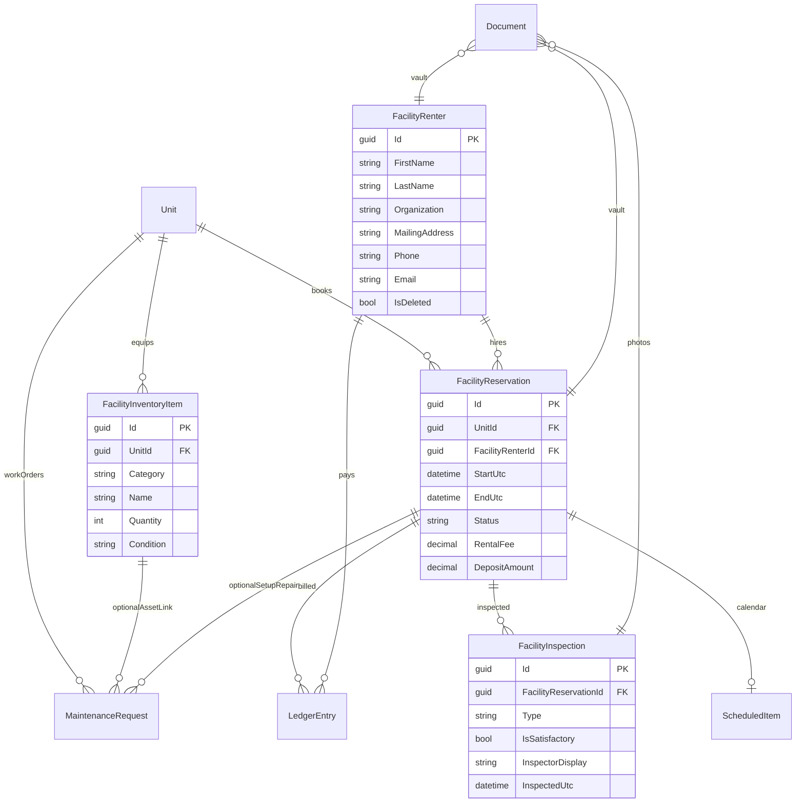

# Data Model: Community Center Facility (002)

**Date**: 2026-08-11 | **Feature**: `002-community-center-facility`
**Timezone**: Store UTC; display `America/Denver` (same as 001)
**Facility unit**: Existing `Unit` where `IsFacility && Number == "CC"`

---

## New / changed entities

| Entity                            | C# type                 | Key fields                                                                                                                                                                           |
| --------------------------------- | ----------------------- | ------------------------------------------------------------------------------------------------------------------------------------------------------------------------------------ |
| **FacilityRenter**                | `FacilityRenter`        | Id, FirstName, LastName, Organization?, MailingAddress, Phone, Email, AlternateContact?, IdType?, IdReference?, Notes?, IsDeleted, RowVersion                                        |
| **FacilityReservation**           | `FacilityReservation`   | Id, UnitId (CC), FacilityRenterId, StartUtc, EndUtc, Status, RentalFee, DepositAmount, Notes?, GeneratedPdfRelativePath?, SignedDocumentId?, ScheduledItemId?, RowVersion, IsDeleted |
| **FacilityInspection**            | `FacilityInspection`    | Id, FacilityReservationId, Type (Pre/Post), IsSatisfactory, ChecklistNotes?, DamageNotes?, InspectorUserId?, InspectorDisplay, InspectedUtc, RowVersion                              |
| **FacilityInventoryItem**         | `FacilityInventoryItem` | Id, UnitId (CC), Category, Name, Quantity, Condition, Location?, Serial?, Notes?, IsDeleted, RowVersion                                                                              |
| **ScheduledItem** *(extend)*      |                         | + `FacilityReservationId?`; Category += `FacilityRental`                                                                                                                             |
| **LedgerEntry** *(extend)*        |                         | + `FacilityReservationId?`, `FacilityRenterId?`; `TenantId` nullable when facility renter set                                                                                        |
| **MaintenanceRequest** *(extend)* |                         | + `CompletedByUserId?`, `CompletedByDisplay?`, `FacilityReservationId?`                                                                                                              |
| **DocumentEntityType** *(extend)* |                         | + FacilityRenter, FacilityReservation, FacilityInspection, FacilityInventoryItem                                                                                                     |
| **DocumentCategory** *(extend)*   |                         | + FacilityAgreement (or reuse Lease), keep Receipt, InspectionPhoto                                                                                                                  |

Residential `Tenant` / `Lease` / apartment `Asset` unchanged for apartment workflows.

---

## Enumerations

### FacilityReservationStatus

`Draft` · `Request` · `Confirmed` · `Cancelled` · `Completed`

### FacilityInspectionType

`PreRental` · `PostRental`

### FacilityInventoryCategory

`Kitchen` · `Chair` · `Table` · `Refrigerator` · `Oven` · `Fixture` · `Other`

### ScheduledItemCategory (extended)

`Cleaning` · `Vacancy` · `Inspection` · `Other` · **`FacilityRental`**

---

## Relationships



---

## Business rules

| Rule                                                                                      | Enforcement                                          |
| ----------------------------------------------------------------------------------------- | ---------------------------------------------------- |
| Reservations only on facility unit                                                        | Service rejects non-`IsFacility` UnitId              |
| No overlapping Confirmed on same unit                                                     | Query Confirmed where ranges overlap; throw conflict |
| EndUtc > StartUtc                                                                         | Validation                                           |
| Soft-delete renter blocked if future Confirmed/Request exists                             | Service rule                                         |
| Unsatisfactory inspection requires DamageNotes                                            | Validation                                           |
| Complete WO requires CompletedByDisplay                                                   | Validation                                           |
| Ledger facility payment: FacilityRenterId XOR residential TenantId required               | One party identity                                   |
| Agreement generate requires renter name + address + phone + email + dates + fee + deposit | Service precheck                                     |
| Audit all mutations                                                                       | AuditLog append-only                                 |
| CC inventory UnitId must be facility                                                      | Service rule                                         |

---

## Suggested FacilityRenter fields (clerk UX)

| Field                | Required          | Notes                                                                                                            |
| -------------------- | ----------------- | ---------------------------------------------------------------------------------------------------------------- |
| FirstName, LastName  | Yes               | Legal name on agreement                                                                                          |
| Organization         | No                | Club / business / family event name                                                                              |
| MailingAddress       | Yes for agreement | Street, city, state, ZIP as single or structured string (v1: single string matching Tenant.MailingAddress style) |
| Phone                | Yes               | Primary                                                                                                          |
| Email                | Yes               | Receipts / contact                                                                                               |
| AlternateContact     | No                | Emergency / day-of contact                                                                                       |
| IdType / IdReference | No                | e.g. DriverLicense / last-4 — do not store full SSN                                                              |
| Notes                | No                | Clerk free text                                                                                                  |

---

## NAS path conventions (additive)

```text
/docs/
├── community-center/
│   ├── renters/{renterId}/
│   ├── reservations/{reservationId}/
│   │   ├── agreement-generated.pdf
│   │   └── agreement-signed.pdf
│   ├── inspections/{inspectionId}/
│   └── inventory/{itemId}/
└── templates/
    ├── cc-rental-agreement.pdf      (preferred AcroForm or static)
    └── cc-rental-agreement.docx     (optional merge source)
```

---

## Migration notes

1. Add tables/columns via EF migration.
2. Demo seeder: stop creating CC `Tenant`/`Lease`; create FacilityRenter + FacilityReservation + ledger + schedule.
3. Optional one-time data fix: if production already has demo CC tenants, provide idempotent cleanup in seeder Clear path only (dev), not silent prod wipe.
4. Make `LedgerEntry.TenantId` nullable with check: `(TenantId != null) != (FacilityRenterId != null)` or allow both null only for rare unit-only adjustments (prefer require one).

**Recommended ledger identity rule**: exactly one of `TenantId` or `FacilityRenterId` must be set.
